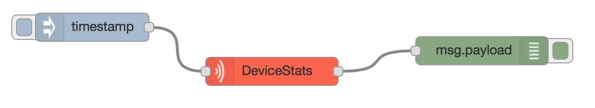
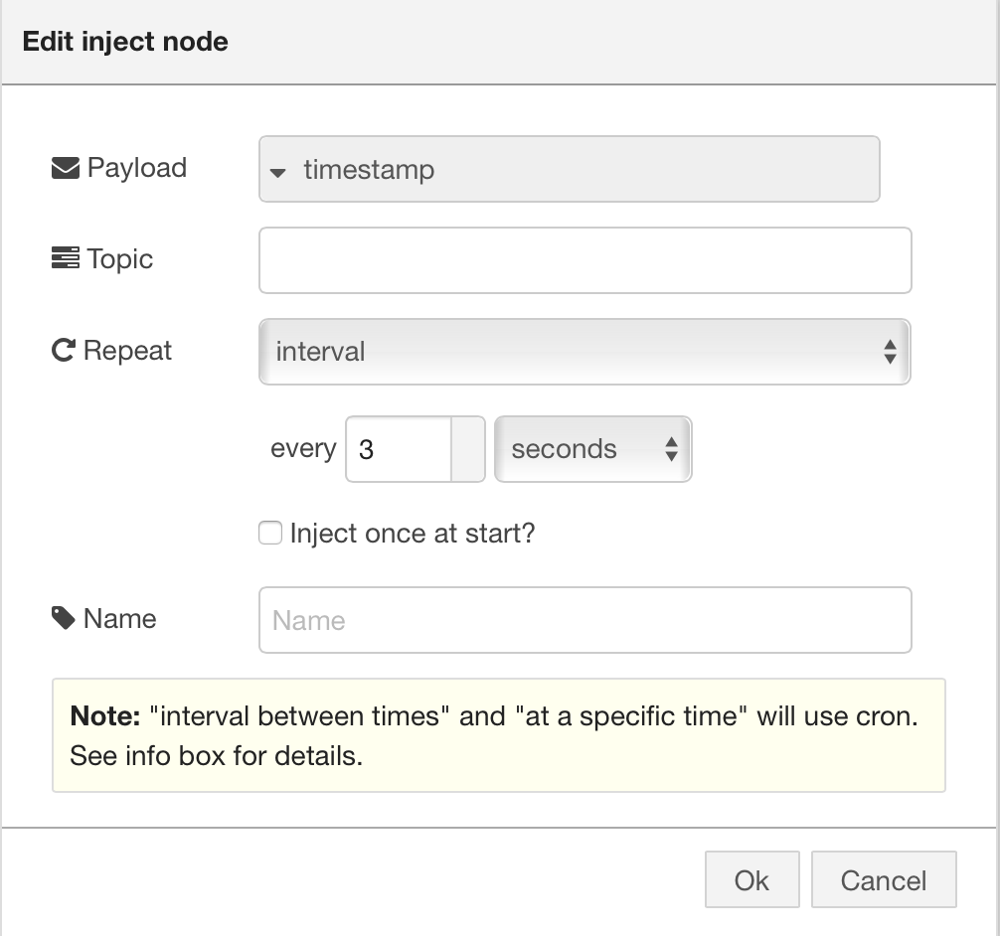
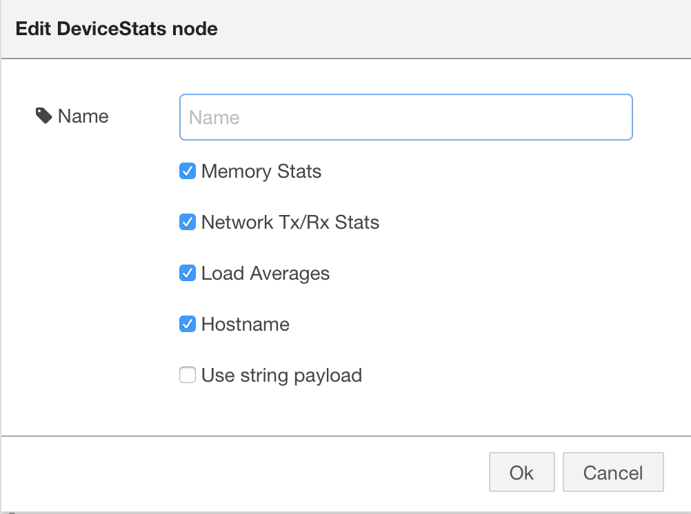
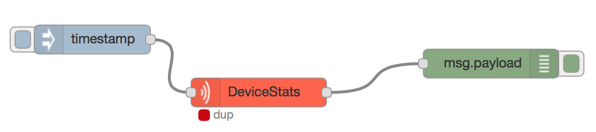

Device Statistics Node-RED node
===

[](https://github.com/dbaba/node-red-contrib-device-stats/releases/latest)
[](https://travis-ci.org/dbaba/node-red-contrib-device-stats/)
[](http://opensource.org/licenses/MIT)

**Linux and MacOS only**

This node creates statistics information according to the node settings on the editor. The statistics will be embedded into msg.payload and emitted to the output port.

This node emits the statistics information when a msg payload arrives via its input port. Otherwise, the node doesn't do anything.

Here is a typical example using this node. This flow will emit the statistics information every 3 seconds.



The left Inject node generates a message payload every 3 seconds. Its settings are as follows.



This Device Statistics node doesn't care of the incoming message payload content but just use it as a trigger to emit the statistics information.

You can configure the content of the statistics information in the following dialog.



When this Device Statistics node emit the stats info, you can see the following status indicator with `dup` status text.



# Prior to building

```
$ npm install
```

# Build

```
$ npm run build
```
will generate ES5 js files.

# Test

```
$ npm run test
```

# Revision History

* 1.0.1
  - Fix deployment error

* 1.0.0
  - Initial public release

# Copyright and License

The project is released under MIT License. See LICENSE for detail.
